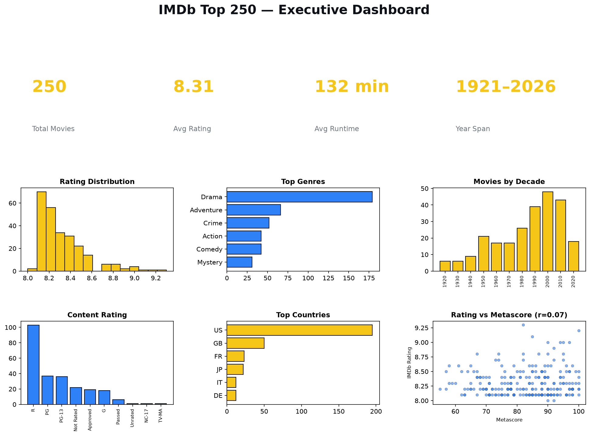

# 🎬 Reel Legends: Decoding IMDb's Top 250

**An honest, end-to-end analysis of what separates a "great movie" from a legend.**

[](https://www.kaggle.com/zohairbaloch)
[](https://www.python.org/)
[](https://pandas.pydata.org/)
[](https://matplotlib.org/)

---

## 📌 Overview

This notebook explores the **IMDb Top 250 Movies (2026 snapshot)** — 250 titles, 27 raw fields each, spanning **1921 to 2026**. Instead of just confirming what everyone already knows ("Shawshank is #1"), the analysis digs into what actually defines this list: genre patterns, era bias, country skew, and whether critics and audiences even agree.

It also includes a genuine **data quality catch** — two movies had un-converted foreign-currency budgets inflating them into the billions — caught, flagged, and handled transparently rather than swept under the rug.

## 🗂️ Dataset

- **Source:** IMDb Top 250 Movies list (2026)
- **Rows:** 250 movies
- **Columns:** 27 (title, genres, ratings, votes, budget, gross, runtime, cast/production metadata, and more)

## 🔍 What's Inside

1. **Setup & Data Loading**
2. **Cleaning & Feature Engineering** — parsing stringified list columns, decade buckets, lead genre/country/studio
3. **Data Quality Catch** — flagging and correcting the currency-mismatched budget rows
4. **Exploratory Data Analysis**
   - Rating & runtime distributions
   - Genre frequency across the list
   - Movies by decade (era bias check)
   - Content rating & country-of-origin breakdown
   - Critic vs. audience agreement (IMDb rating vs. Metascore)
   - Budget vs. worldwide gross
   - Best return-on-investment titles
5. **Key Findings Summary**
6. **Executive Dashboard** — one-page visual summary (see below)

## 💡 Key Findings

- The Top 250 is a **tight cluster** — most films sit within 0.3 rating points of each other.
- **Drama appears in 72% of the list** (179/250 films) — the closest thing to a common ingredient across "greatness."
- The list carries a real **recency and Western skew** — the 1990s–2000s and the US dominate representation.
- **Critic scores and audience scores barely correlate (r ≈ 0.07)** — Metascore and IMDb rating are measuring genuinely different things.
- **Budget doesn't buy a spot on this list** — several of the highest-rated and highest-ROI films were made for a fraction of blockbuster budgets.

## 📊 Executive Dashboard



## 🛠️ Tech Stack

- **Python** — pandas, NumPy
- **Matplotlib** — all visualizations (no Plotly, for full Kaggle/GitHub notebook rendering compatibility)
- **Jupyter Notebook**

## 🚀 How to Run

```bash
git clone <this-repo-url>
cd <repo-folder>
pip install pandas numpy matplotlib jupyter
jupyter notebook Reel_Legends_Decoding_IMDb_Top_250.ipynb
```

## 👤 Author

**Zohair Baloch** — Data Analyst
[Kaggle](https://www.kaggle.com/zohairbaloch) · [GitHub](https://github.com/zohairbaloch-64) · [LinkedIn](https://www.linkedin.com/in/zohair-baloch-data-analyst)
